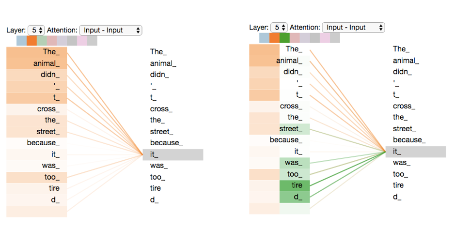
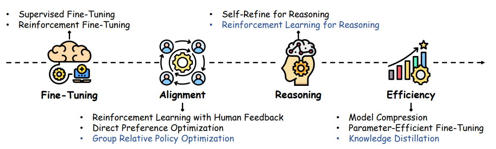
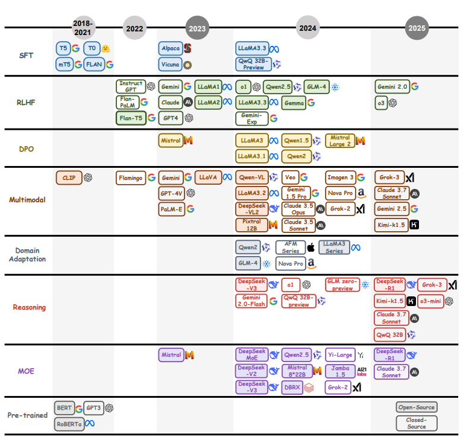

# Introducción a los modelos GPT y su aplicación en la programación

## Objetivo general

Comprender la base conceptual y arquitectónica de los modelos GPT, su proceso de entrenamiento y evolución, para utilizarlos de forma informada y efectiva en tareas de programación y desarrollo de software.

## ¿Qué es un modelo GPT?

**GPT** proviene de _Generative Pretrained Transformer_ y describe una **arquitectura de modelo de lenguaje**, no una marca específica.

```{admonition} Significado de GPT
:class: tip

* **Generative** → El modelo puede *generar* texto (no solo analizarlo o clasificarlo).
* **Pretrained** → Ha sido *preentrenado* con grandes volúmenes de datos antes de afinarse en tareas específicas.
* **Transformer** → Utiliza mecanismos de *autoatención (self-attention)* para procesar y generar secuencias de texto de manera contextual.
```

Los GPT forman parte de una familia de **redes neuronales profundas _(deep learning)_ basadas en la arquitectura** `Transformer`, diseñadas para procesar y generar texto de forma coherente y contextual.

En esencia, un modelo GPT analiza consultas en lenguaje natural (denominadas _prompts_) y predice la respuesta más probable basándose en patrones aprendidos durante su entrenamiento.

La arquitectura Transformer permite al modelo enfocarse en distintas partes del texto de entrada simultáneamente, capturando mejor las relaciones contextuales y mejorando el rendimiento en tareas de procesamiento de lenguaje natural _(Natural Language Processing, NLP)_.



**Figura 1:** Visualización del mecanismo de autoatención _(self-attention)_ en un modelo Transformer. Cada matriz muestra cómo el modelo distribuye su atención entre las palabras de la oración _“The animal didn’t cross the street because it was too tired”_. En la imagen izquierda, la atención está más dispersa: el modelo analiza múltiples relaciones entre palabras sin un foco semántico claro. En la imagen derecha, a medida que avanza el entrenamiento o las capas de la red, la atención se vuelve más específica: el modelo asocia correctamente “it” con “the animal”, demostrando cómo el Transformer aprende dependencias contextuales de largo alcance. Fuente: Adaptado de Jay Alammar, “The Illustrated Transformer” (2018). Disponible en [GitHub](https://jalammar.github.io/illustrated-transformer/).

## Arquitectura básica de un _Transformer_

Un modelo Transformer se compone de dos módulos principales:

### 1. Codificador (_Encoder_)

El codificador convierte el texto en _embeddings_, que son representaciones numéricas de las palabras en un espacio vectorial.  
En este espacio, las palabras con significados similares tienden a ubicarse más cerca unas de otras.

El encoder procesa estas _embeddings_ y asigna **pesos de atención**, que indican la relevancia contextual de cada palabra dentro de la oración. Además, los **codificadores posicionales** permiten que el modelo entienda el orden de las palabras, evitando ambigüedades en el significado.

### 2. Decodificador (_Decoder_)

El decodificador utiliza las representaciones vectoriales generadas por el encoder para **predecir la salida deseada**. Mediante mecanismos de autoatención y cálculos probabilísticos, el decodificador evalúa múltiples posibles continuaciones y selecciona la más adecuada según el contexto.

A diferencia de las redes neuronales recurrentes, los transformers **procesan toda la secuencia de texto simultáneamente**, lo que permite **entrenamientos paralelos**.

```{figure} ../_static/transformer.png
:alt: transformer
:fig-align: center
:width: 300px
```

**Figura 2**: Arquitectura de un modelo GPT. Fuente: Vaswani et al., 2017. Disponible en [ArXiv](https://arxiv.org/abs/1706.03762v7).

## Ejemplos de modelos GPT y sus variantes

Aunque ChatGPT es el ejemplo más conocido —desarrollado por **OpenAI** y basado en las arquitecturas **GPT-3.5** y **GPT-4**—, existen otros modelos de lenguaje desarrollados por distintas organizaciones:

| Modelo      | Desarrollador   | Enfoque principal                                                     |
| ----------- | --------------- | --------------------------------------------------------------------- |
| **GPT-5**   | OpenAI          | Evolución de GPT-4, con mejoras en comprensión y generación de texto. |
| **Claude**  | Anthropic       | Priorización de seguridad, alineación ética y control de sesgos.      |
| **LLaMA**   | Meta            | Modelo eficiente y accesible, optimizado para investigación.          |
| **Bard**    | Google          | Integración entre generación de texto y búsqueda en la web.           |
| **Gemini**  | Google DeepMind | Combinación de lenguaje, razonamiento y capacidades multimodales.     |
| **Mistral** | Mistral AI      | Foco en eficiencia, rendimiento y modelos abiertos de alta calidad.   |

## ¿Por qué existen tantos modelos GPT?

La diversidad de modelos GPT no se debe únicamente a la competencia entre empresas, sino a la **evolución continua de las técnicas de entrenamiento** que buscan mejorar su rendimiento, especialización y eficiencia.

Para comprender esta evolución, es importante distinguir dos etapas estrechamente relacionadas en el desarrollo de los modelos de lenguaje: el **preentrenamiento** (_pre-training_) y el **postentrenamiento** (_post-training_).

Estas dos fases no son independientes:

**todo modelo postentrenado proviene necesariamente de un modelo preentrenado**.

El preentrenamiento establece la base del conocimiento general del lenguaje, mientras que el postentrenamiento adapta ese conocimiento a tareas concretas, contextos específicos y comportamientos alineados con las necesidades humanas.

### Pre-training _(Preentrenamiento)_

Durante esta primera fase, el modelo aprende los _patrones generales del lenguaje_ a partir de grandes volúmenes de texto no etiquetado.

El objetivo es crear una base sólida de comprensión lingüistica: gramática, semántica y contexto, sin enfocarse aún en tareas específicas.

Ejemplos de modelos preentrenados incluyen `Word2Vec`, `BERT` y `GPT`.

Esta etapa define la _capacidad general de comprensión del modelo, pero no garantiza un comportamiento útil con objetivos humanos._

### Post-training _(Postentrenamiento)_

Una vez completado el preentrenamiento, el modelo pasa a una segunda fase: el **postentrenamiento**, donde se **refina y especializa** en tareas concretas o estilos de interacción específicos.

Podemos decir que el postentrenamiento “enseña al modelo a aplicar lo que aprendió”.

Aquí se ajusta para generar código, traducir idiomas, responder preguntas, mantener conversaciones o realizar razonamientos complejos de manera más coherente y segura.

El postentrenamiento combina varias técnicas complementarias:



**Figura 3:** Principales paradigmas de postentrenamiento en modelos de lenguaje. Fuente: Tie, _et al._, 2025. Disponible en [ArXiv](https://arxiv.org/abs/2503.06072).

- **Fine-tuning:** ajuste supervisado con ejemplos y datos etiquetados que orientan al modelo hacia tareas específicas.
- **Alignment:** alineación con preferencias y valores humanos mediante métodos como _Reinforcement Learning with Human Feedback (RLHF)_ o _Direct Preference Optimization (DPO)_.
- **Reasoning y eficiencia:** optimización de la capacidad de razonamiento y reducción del costo computacional, por ejemplo, mediante _parameter-efficient fine-tuning (PEFT)_ o arquitecturas _Mixture of Experts (MoE)_.

Gracias a estas técnicas, los modelos postentrenados —como **GPT-4**, **Claude 3.5**, **LLaMA 3** o **Gemini 2.0**— logran un comportamiento más preciso, alineado y adaptable.  
Cada nueva generación representa una mejora sobre su base preentrenada, marcando un ciclo continuo de **aprendizaje general → ajuste especializado → evolución del modelo**.

## Evolución del postentrenamiento en los modelos GPT

La figura siguiente resume la evolución histórica de las **técnicas de post-training** aplicadas a los **Modelos de Lenguaje Grandes (LLMs)** desde **2018 hasta 2025**.

Cada etapa representa un avance metodológico clave que ha permitido que los modelos GPT —y sus equivalentes desarrollados por otras organizaciones— se vuelvan más **precisos, adaptables y eficientes**.



**Figura 4:** Línea de tiempo del desarrollo de técnicas de postentrenamiento en modelos de lenguaje (2018–2025), mostrando los principales hitos y modelos representativos. Fuente: Tie, _et al._, 2025. Disponible en [ArXiv](https://arxiv.org/abs/2503.06072).

### Etapas principales de la evolución

**2018–2021: Fundamentos del Fine-Tuning**

- Modelos como `T5`, `mT5`, y `FLAN` introdujeron la idea de _instrucción_ y _fine-tuning supervisado (SFT)_, sentando las bases del entrenamiento instruccional.
- Se consolidó el enfoque “_pre-train + fine-tune_”, donde los modelos generalistas se adaptan a tareas específicas.

**2022: Nacimiento del Alignment con RLHF**

- OpenAI lanzó **InstructGPT**, aplicando _Reinforcement Learning with Human Feedback (RLHF)_ para alinear los modelos con las preferencias humanas.
- Surgen otros modelos influyentes como `Flan-PaLM` y `Claude`, que fortalecen la seguridad y la alineación ética.

**2023: Expansión y diversificación**

- Aparecen técnicas alternativas como **Direct Preference Optimization (DPO)** y enfoques multimodales (texto + imagen).
- En este periodo, el campo explota en variedad de métodos y arquitecturas, incluyendo _Mixture of Experts (MoE)_ para mejorar la eficiencia computacional.

**2024: Avances en razonamiento y especialización**

- Modelos como `DeepSeek-V3`, `Gemini 2.0`, y `Claude 3.7` comienzan a centrarse en la **capacidad de razonamiento lógico (Reasoning)**.
- Surgen técnicas de **adaptación por dominio (Domain Adaptation)** para áreas específicas como finanzas, salud o programación.

**2025: Consolidación y optimización**

- Modelos de nueva generación como `GPT-5`, `Gemini 2.5`, `Grok-3`, y `DeepSeek-R1` integran múltiples paradigmas de postentrenamiento.
- Estas versiones combinan razonamiento, eficiencia y alineación avanzada, marcando la madurez del desarrollo de LLMs.

## ¿Para qué me sirve saber esto?

Comprender cómo surgen y evolucionan los modelos GPT no es solo un dato histórico: es una **base práctica para usarlos mejor** en programación y desarrollo de software.

Cada fase del entrenamiento —desde el preentrenamiento hasta el postentrenamiento— determina **cómo piensa, razona y responde un modelo**.  
Conocer estas etapas te ayuda a entender **qué puedes esperar de un GPT** y **cómo aprovecharlo según su diseño y capacidades**.

Conocer las diferencias entre modelos (por ejemplo, GPT-4 vs Gemini o Claude) te da criterio para:

- Elegir el modelo adecuado según la tarea (razonamiento, generación, análisis, etc.).

- Entender sus **limitaciones técnicas y sesgos**.

- Diseñar _prompts_ más precisos que aprovechen la estructura interna del modelo.

```{admonition} Mensaje clave
:class: tip

 💡 Esto convierte al programador o analista no solo en un usuario del GPT, sino en alguien capaz de **dialogar técnicamente** con la inteligencia artificial, integrándola de manera estratégica en su flujo de trabajo.
```
